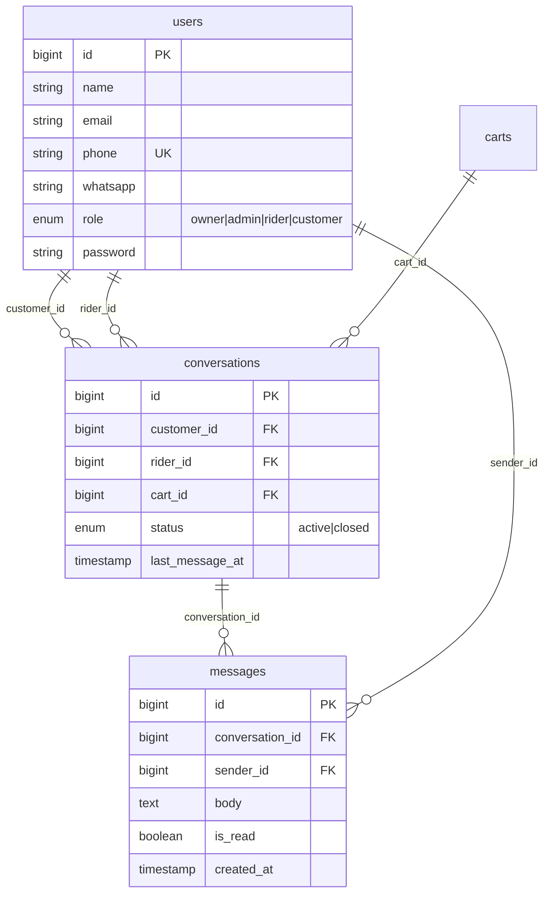
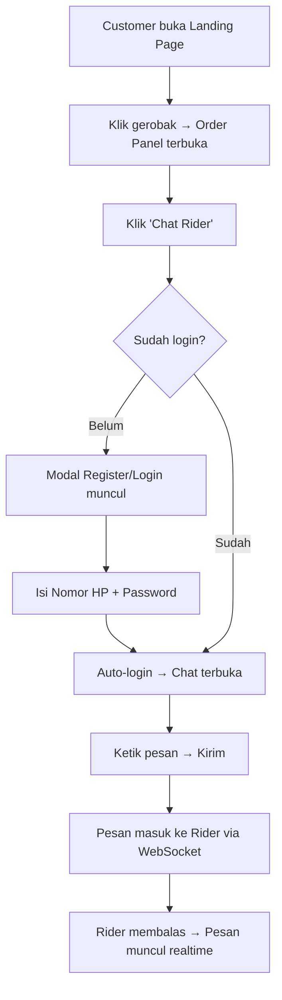
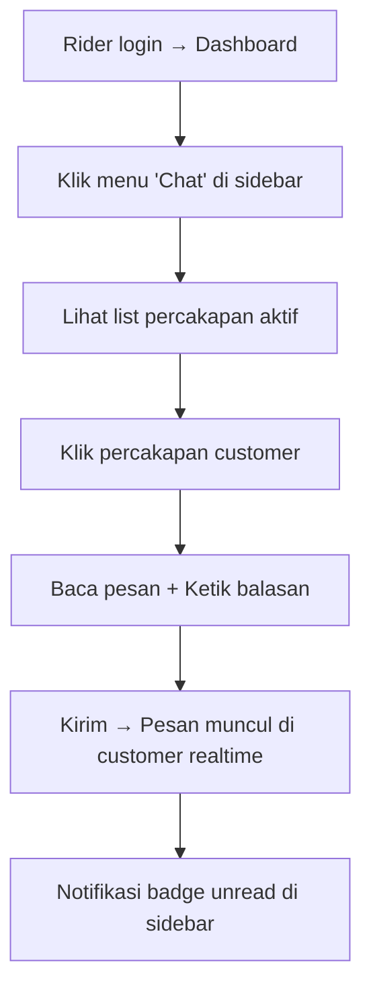

# Fitur Direct Message (DM) Customer ↔ Rider

## 1. Overview

Menambahkan fitur chat realtime antara **customer** dan **rider** di Tether Brew. Tombol "💬 Chat Rider" ditempatkan di samping "Pesan via WhatsApp" pada order panel.

### Stack yang Digunakan

| Komponen | Teknologi | Alasan |
|----------|-----------|--------|
| WebSocket Server | **Laravel Reverb** | Gratis, official Laravel, self-hosted |
| Frontend Client | **Laravel Echo + pusher-js** | Auto-included saat install broadcasting |
| Auth Customer | Phone + Password | Sederhana, OTP bisa ditambah nanti |
| Database | MySQL (existing) | Tabel conversations + messages |

---

## 2. Database Schema

### 2.1 Migration: Tambah Role Customer + Phone

**File:** `database/migrations/xxxx_add_customer_support_to_users_table.php`

```php
Schema::table('users', function (Blueprint $table) {
    // Ubah enum role: tambah 'customer'
    $table->string('phone', 20)->nullable()->unique()->after('whatsapp');
});

// Jalankan raw SQL untuk alter enum (MySQL)
DB::statement("ALTER TABLE users MODIFY COLUMN role 
    ENUM('owner','admin','rider','customer') DEFAULT 'customer'");
```

> [!NOTE]
> Field `phone` terpisah dari `whatsapp` yang sudah ada. `phone` digunakan untuk login customer, `whatsapp` untuk rider WA link.

### 2.2 Migration: Tabel Conversations

**File:** `database/migrations/xxxx_create_conversations_table.php`

```php
Schema::create('conversations', function (Blueprint $table) {
    $table->id();
    $table->foreignId('customer_id')->constrained('users')->cascadeOnDelete();
    $table->foreignId('rider_id')->constrained('users')->cascadeOnDelete();
    $table->foreignId('cart_id')->nullable()->constrained('carts')->nullOnDelete();
    $table->enum('status', ['active', 'closed'])->default('active');
    $table->timestamp('last_message_at')->nullable();
    $table->timestamps();

    $table->unique(['customer_id', 'rider_id', 'cart_id']);
});
```

### 2.3 Migration: Tabel Messages

**File:** `database/migrations/xxxx_create_messages_table.php`

```php
Schema::create('messages', function (Blueprint $table) {
    $table->id();
    $table->foreignId('conversation_id')->constrained()->cascadeOnDelete();
    $table->foreignId('sender_id')->constrained('users')->cascadeOnDelete();
    $table->text('body');
    $table->boolean('is_read')->default(false);
    $table->timestamps();

    $table->index(['conversation_id', 'created_at']);
});
```

### Diagram Relasi



---

## 3. Models

### 3.1 [MODIFY] User.php

```php
// Tambahan di User model:
public function isCustomer(): bool
{
    return $this->role === 'customer';
}

public function customerConversations(): HasMany
{
    return $this->hasMany(Conversation::class, 'customer_id');
}

public function riderConversations(): HasMany
{
    return $this->hasMany(Conversation::class, 'rider_id');
}
```

### 3.2 [NEW] Conversation.php

```php
class Conversation extends Model
{
    protected $fillable = ['customer_id', 'rider_id', 'cart_id', 'status', 'last_message_at'];
    protected $casts = ['last_message_at' => 'datetime'];

    public function customer(): BelongsTo { return $this->belongsTo(User::class, 'customer_id'); }
    public function rider(): BelongsTo { return $this->belongsTo(User::class, 'rider_id'); }
    public function cart(): BelongsTo { return $this->belongsTo(Cart::class); }
    public function messages(): HasMany { return $this->hasMany(Message::class)->orderBy('created_at'); }
    public function latestMessage(): HasOne { return $this->hasOne(Message::class)->latestOfMany(); }
    
    public function unreadCountFor(int $userId): int
    {
        return $this->messages()->where('sender_id', '!=', $userId)->where('is_read', false)->count();
    }
}
```

### 3.3 [NEW] Message.php

```php
class Message extends Model
{
    protected $fillable = ['conversation_id', 'sender_id', 'body', 'is_read'];

    public function conversation(): BelongsTo { return $this->belongsTo(Conversation::class); }
    public function sender(): BelongsTo { return $this->belongsTo(User::class, 'sender_id'); }
}
```

---

## 4. Customer Auth

### 4.1 [NEW] CustomerAuthController.php

**File:** `app/Http/Controllers/Auth/CustomerAuthController.php`

```php
class CustomerAuthController extends Controller
{
    public function showLogin()
    {
        return view('customer.auth.login');
    }

    public function login(Request $request)
    {
        $request->validate([
            'phone' => ['required', 'string'],
            'password' => ['required'],
        ]);

        // Cari user customer berdasarkan phone
        $user = User::where('phone', $request->phone)
                     ->where('role', 'customer')
                     ->first();

        if ($user && Hash::check($request->password, $user->password)) {
            Auth::login($user, $request->boolean('remember'));
            $request->session()->regenerate();
            return redirect()->intended('/');
        }

        return back()->withErrors(['phone' => 'Nomor HP atau password salah.']);
    }

    public function showRegister()
    {
        return view('customer.auth.register');
    }

    public function register(Request $request)
    {
        $request->validate([
            'name' => ['required', 'string', 'max:100'],
            'phone' => ['required', 'string', 'max:20', 'unique:users,phone'],
            'password' => ['required', 'confirmed', 'min:6'],
        ]);

        $user = User::create([
            'name' => $request->name,
            'phone' => $request->phone,
            'email' => 'customer_' . time() . '@tetherbrew.local', // placeholder
            'password' => Hash::make($request->password),
            'role' => 'customer',
        ]);

        Auth::login($user);
        return redirect('/');
    }

    public function logout(Request $request)
    {
        Auth::logout();
        $request->session()->invalidate();
        $request->session()->regenerateToken();
        return redirect('/');
    }
}
```

> [!NOTE]
> Email di-generate otomatis sebagai placeholder karena field `email` saat ini `unique` dan `required`. Customer login via `phone`, bukan email.

### 4.2 Customer Auth Routes

```php
// Di web.php — PUBLIC customer auth
Route::prefix('customer')->name('customer.')->middleware('guest')->group(function () {
    Route::get('/login', [CustomerAuthController::class, 'showLogin'])->name('login');
    Route::post('/login', [CustomerAuthController::class, 'login']);
    Route::get('/register', [CustomerAuthController::class, 'showRegister'])->name('register');
    Route::post('/register', [CustomerAuthController::class, 'register']);
});
Route::post('/customer/logout', [CustomerAuthController::class, 'logout'])
    ->middleware('auth')->name('customer.logout');
```

### 4.3 Customer Auth Views

**Login** — `resources/views/customer/auth/login.blade.php`
- Form: Phone + Password
- Link ke register
- Desain sesuai aesthetic landing page (dark/light theme)

**Register** — `resources/views/customer/auth/register.blade.php`
- Form: Nama + Phone + Password + Konfirmasi Password
- Link ke login

---

## 5. Realtime Broadcasting (Laravel Reverb)

### 5.1 Instalasi

```bash
php artisan install:broadcasting
# Pilih: Reverb
# Jawab Yes untuk install NPM dependencies
```

Ini otomatis:
- Install `laravel/reverb` (composer)
- Install `laravel-echo` + `pusher-js` (npm)
- Buat `config/broadcasting.php`, `config/reverb.php`, `routes/channels.php`
- Update `.env` dengan Reverb credentials

### 5.2 [MODIFY] `.env` — Perubahan Setelah Install

```env
BROADCAST_CONNECTION=reverb

REVERB_APP_ID=... (auto-generated)
REVERB_APP_KEY=... (auto-generated)
REVERB_APP_SECRET=... (auto-generated)
REVERB_HOST=localhost
REVERB_PORT=8080
REVERB_SCHEME=http

VITE_REVERB_APP_KEY="${REVERB_APP_KEY}"
VITE_REVERB_HOST="${REVERB_HOST}"
VITE_REVERB_PORT="${REVERB_PORT}"
VITE_REVERB_SCHEME="${REVERB_SCHEME}"
```

### 5.3 [MODIFY] `composer.json` dev script

```json
"dev": [
    "Composer\\Config::disableProcessTimeout",
    "npx concurrently -c \"#93c5fd,#c4b5fd,#fb7185,#fdba74,#86efac\" \"php artisan serve\" \"php artisan queue:listen --tries=1 --timeout=0\" \"php artisan pail --timeout=0\" \"npm run dev\" \"php artisan reverb:start\" --names=server,queue,logs,vite,reverb --kill-others"
]
```

### 5.4 [NEW] Event: MessageSent.php

**File:** `app/Events/MessageSent.php`

```php
class MessageSent implements ShouldBroadcast
{
    use Dispatchable, InteractsWithSockets, SerializesModels;

    public function __construct(public Message $message) {}

    public function broadcastOn(): array
    {
        return [new PrivateChannel('conversation.' . $this->message->conversation_id)];
    }

    public function broadcastWith(): array
    {
        return [
            'id' => $this->message->id,
            'conversation_id' => $this->message->conversation_id,
            'sender_id' => $this->message->sender_id,
            'sender_name' => $this->message->sender->name,
            'body' => $this->message->body,
            'created_at' => $this->message->created_at->toISOString(),
        ];
    }
}
```

### 5.5 [MODIFY] `routes/channels.php`

```php
Broadcast::channel('conversation.{conversationId}', function ($user, $conversationId) {
    $conversation = \App\Models\Conversation::find($conversationId);
    if (!$conversation) return false;
    return $user->id === $conversation->customer_id || $user->id === $conversation->rider_id;
});
```

---

## 6. Chat Controller

### 6.1 [NEW] ChatController.php

**File:** `app/Http/Controllers/ChatController.php`

```php
class ChatController extends Controller
{
    // Customer: Mulai/resume percakapan
    public function startConversation(Request $request)
    {
        $request->validate([
            'rider_id' => 'required|exists:users,id',
            'cart_id' => 'nullable|exists:carts,id',
        ]);

        $conversation = Conversation::firstOrCreate(
            [
                'customer_id' => auth()->id(),
                'rider_id' => $request->rider_id,
                'cart_id' => $request->cart_id,
            ],
            ['status' => 'active']
        );

        return response()->json([
            'conversation' => $conversation->load(['rider', 'cart']),
        ]);
    }

    // Shared: Kirim pesan
    public function sendMessage(Request $request, Conversation $conversation)
    {
        $this->authorizeConversation($conversation);

        $request->validate(['body' => 'required|string|max:1000']);

        $message = $conversation->messages()->create([
            'sender_id' => auth()->id(),
            'body' => $request->body,
        ]);

        $conversation->update(['last_message_at' => now()]);

        broadcast(new MessageSent($message->load('sender')))->toOthers();

        return response()->json(['message' => $message->load('sender')]);
    }

    // Shared: Ambil pesan (paginated)
    public function getMessages(Conversation $conversation)
    {
        $this->authorizeConversation($conversation);

        $messages = $conversation->messages()
            ->with('sender:id,name,role')
            ->orderByDesc('created_at')
            ->paginate(50);

        return response()->json($messages);
    }

    // Customer: Tandai pesan sebagai dibaca
    public function markAsRead(Conversation $conversation)
    {
        $this->authorizeConversation($conversation);

        $conversation->messages()
            ->where('sender_id', '!=', auth()->id())
            ->where('is_read', false)
            ->update(['is_read' => true]);

        return response()->json(['success' => true]);
    }

    // Rider: List semua percakapan
    public function riderConversations()
    {
        $conversations = Conversation::where('rider_id', auth()->id())
            ->with(['customer:id,name,phone', 'cart:id,name', 'latestMessage'])
            ->withCount(['messages as unread_count' => function ($q) {
                $q->where('sender_id', '!=', auth()->id())->where('is_read', false);
            }])
            ->orderByDesc('last_message_at')
            ->get();

        return view('rider.chat', compact('conversations'));
    }

    // Rider: Halaman chat detail
    public function riderChat(Conversation $conversation)
    {
        $this->authorizeConversation($conversation);
        $conversation->load(['customer', 'cart']);
        return view('rider.chat-detail', compact('conversation'));
    }

    private function authorizeConversation(Conversation $conversation): void
    {
        $userId = auth()->id();
        if ($conversation->customer_id !== $userId && $conversation->rider_id !== $userId) {
            abort(403);
        }
    }
}
```

### 6.2 Chat Routes (di `web.php`)

```php
// Customer chat (auth + role:customer)
Route::middleware(['auth', 'role:customer'])->prefix('chat')->name('chat.')->group(function () {
    Route::post('/start', [ChatController::class, 'startConversation'])->name('start');
    Route::get('/{conversation}/messages', [ChatController::class, 'getMessages'])->name('messages');
    Route::post('/{conversation}/send', [ChatController::class, 'sendMessage'])->name('send');
    Route::post('/{conversation}/read', [ChatController::class, 'markAsRead'])->name('read');
});

// Rider chat
Route::middleware('role:rider')->prefix('rider/chat')->name('rider.chat.')->group(function () {
    Route::get('/', [ChatController::class, 'riderConversations'])->name('index');
    Route::get('/{conversation}', [ChatController::class, 'riderChat'])->name('show');
    Route::get('/{conversation}/messages', [ChatController::class, 'getMessages'])->name('messages');
    Route::post('/{conversation}/send', [ChatController::class, 'sendMessage'])->name('send');
});
```

---

## 7. Frontend UI

### 7.1 [MODIFY] Order Panel — Tombol DM

Di `welcome.blade.php`, tambah tombol di samping "Pesan via WhatsApp":

```html
<div class="order-action-buttons" style="margin-top: 8px;">
    <!-- Tombol WA yang sudah ada -->
    <a id="order-wa-btn" href="#" target="_blank" class="order-wa-btn disabled">
        ...Pesan via WhatsApp
    </a>
    <!-- BARU: Tombol Chat Rider -->
    <button id="order-dm-btn" class="order-dm-btn" onclick="openChat()">
        <svg>...</svg> Chat Rider
    </button>
</div>
```

### 7.2 Chat Modal (Customer Side)

Tambah di `welcome.blade.php` sebelum `</body>`:

```html
<!-- Auth Modal (Login/Register) -->
<div id="auth-modal" class="chat-modal">...</div>

<!-- Chat Drawer -->
<div id="chat-drawer" class="chat-drawer">
    <div class="chat-drawer-header">
        <span id="chat-rider-name">Rider Name</span>
        <button onclick="closeChat()">✕</button>
    </div>
    <div id="chat-messages" class="chat-messages">
        <!-- Messages rendered by JS -->
    </div>
    <div class="chat-input-wrapper">
        <input id="chat-input" type="text" placeholder="Ketik pesan...">
        <button id="chat-send-btn" onclick="sendChatMessage()">Kirim</button>
    </div>
</div>
```

### 7.3 Chat Bubbles Design

```css
.chat-bubble {
    max-width: 75%;
    padding: 10px 14px;
    border-radius: 16px;
    margin-bottom: 8px;
    font-size: 0.9rem;
    animation: bubbleIn 0.2s ease-out;
}
.chat-bubble.sent {
    /* Customer/sender — kanan */
    background: var(--accent);
    color: white;
    align-self: flex-end;
    border-bottom-right-radius: 4px;
}
.chat-bubble.received {
    /* Rider/receiver — kiri */
    background: var(--card-bg);
    border: 1px solid var(--border);
    align-self: flex-start;
    border-bottom-left-radius: 4px;
}
```

### 7.4 [MODIFY] landing.js — Chat Logic

```javascript
// State
let currentConversation = null;
let chatEcho = null;

function openChat() {
    // Check if logged in as customer
    const isLoggedIn = document.body.dataset.customerId;
    if (!isLoggedIn) {
        openAuthModal(); // Show login/register
        return;
    }
    startChat();
}

async function startChat() {
    const riderId = currentOrderCart.rider_id;
    const cartId = currentOrderCart.id;
    
    const res = await fetch('/chat/start', {
        method: 'POST',
        headers: {
            'Content-Type': 'application/json',
            'X-CSRF-TOKEN': document.querySelector('meta[name="csrf-token"]').content,
        },
        body: JSON.stringify({ rider_id: riderId, cart_id: cartId }),
    });
    
    const data = await res.json();
    currentConversation = data.conversation;
    
    openChatDrawer();
    loadMessages();
    subscribeToChatChannel();
}

function subscribeToChatChannel() {
    if (!chatEcho) {
        chatEcho = new Echo({
            broadcaster: 'reverb',
            key: import.meta.env.VITE_REVERB_APP_KEY,
            wsHost: import.meta.env.VITE_REVERB_HOST,
            wsPort: import.meta.env.VITE_REVERB_PORT,
            forceTLS: false,
            enabledTransports: ['ws', 'wss'],
        });
    }

    chatEcho.private(`conversation.${currentConversation.id}`)
        .listen('MessageSent', (e) => {
            appendMessage(e, 'received');
            scrollToBottom();
        });
}
```

### 7.5 Rider Chat Page

**File:** `resources/views/rider/chat.blade.php`

Layout dua panel:
- **Panel Kiri**: List percakapan (customer name, last message preview, unread badge, timestamp)
- **Panel Kanan**: Area chat aktif (messages + input)

Menggunakan Laravel Echo untuk mendengarkan pesan masuk realtime.

---

## 8. Sidebar Rider — Menu Chat

### [MODIFY] `layouts/app.blade.php`

Tambah menu "Chat" di sidebar rider dengan unread badge:

```html
@if(auth()->user()->isRider())
    <a href="{{ route('rider.chat.index') }}" class="nav-link {{ request()->routeIs('rider.chat.*') ? 'active' : '' }}">
        <span class="nav-link-icon">
            <svg><!-- chat icon --></svg>
        </span> 
        Chat
        @if($unreadChatCount > 0)
            <span class="badge-unread">{{ $unreadChatCount }}</span>
        @endif
    </a>
@endif
```

---

## 9. Alur Lengkap (Flow)

### Customer Flow


### Rider Flow


---

## 10. File Summary

| # | File | Aksi | Komponen |
|---|------|------|----------|
| 1 | `database/migrations/xxxx_add_customer_support.php` | NEW | DB: role customer + phone |
| 2 | `database/migrations/xxxx_create_conversations.php` | NEW | DB: tabel conversations |
| 3 | `database/migrations/xxxx_create_messages.php` | NEW | DB: tabel messages |
| 4 | `app/Models/User.php` | MODIFY | Model: isCustomer, relasi |
| 5 | `app/Models/Conversation.php` | NEW | Model |
| 6 | `app/Models/Message.php` | NEW | Model |
| 7 | `app/Http/Controllers/Auth/CustomerAuthController.php` | NEW | Auth customer |
| 8 | `resources/views/customer/auth/login.blade.php` | NEW | View login |
| 9 | `resources/views/customer/auth/register.blade.php` | NEW | View register |
| 10 | `app/Events/MessageSent.php` | NEW | Broadcast event |
| 11 | `routes/channels.php` | MODIFY | Channel auth |
| 12 | `app/Http/Controllers/ChatController.php` | NEW | Chat API |
| 13 | `routes/web.php` | MODIFY | Routes baru |
| 14 | `resources/views/welcome.blade.php` | MODIFY | Tombol DM + chat drawer + auth modal |
| 15 | `resources/js/landing.js` | MODIFY | Chat logic + Echo |
| 16 | `resources/css/landing.css` | MODIFY | Chat styles |
| 17 | `resources/views/rider/chat.blade.php` | NEW | Rider chat list |
| 18 | `resources/views/rider/chat-detail.blade.php` | NEW | Rider chat window |
| 19 | `resources/views/layouts/app.blade.php` | MODIFY | Sidebar: menu chat |
| 20 | `resources/js/app.js` | MODIFY | Echo setup |
| 21 | `.env` | MODIFY | Reverb config |
| 22 | `composer.json` | MODIFY | Dev script + reverb |

---

## 11. Verification Plan

### Dev Server Start
```bash
composer dev
# Ini akan start: server + queue + logs + vite + reverb
```

### Test Checklist
- [ ] `php artisan migrate` — 3 migration sukses
- [ ] Register customer baru (phone + password)
- [ ] Login customer
- [ ] Klik "Chat Rider" di order panel → chat terbuka
- [ ] Kirim pesan dari customer → muncul di rider dashboard
- [ ] Rider balas → muncul di customer realtime
- [ ] Unread badge muncul di sidebar rider
- [ ] Logout customer → redirect ke landing
